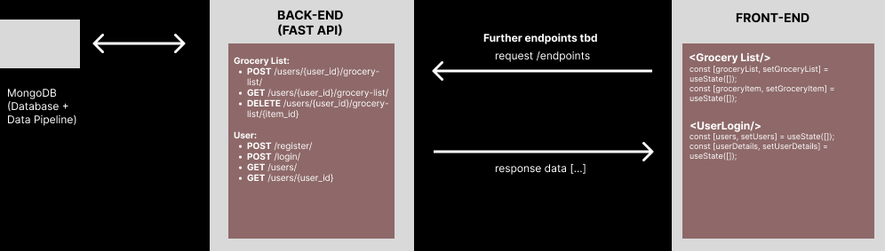

# Welcome to the Chop N' Shop Backend
This is backend of our prototype fullstack application for Chop N' Shop, our grocery shopping assistant. We integrated several of our **FastAPI** endpoints with our **MongoDB** database and Frontend components. This prototype will allow you to register a new user, authenticate an existing user, and retrieve a recipe.

## Setting Up & Running Instructions
### Backend Setup
#### 1. Clone the Backend Repository
  ```
    git clone https://github.com/dimash-web/chop-n-shop-database.git
    cd chop-n-shop-database
  ```
#### 2. Set Up a Virtual Environment
  ```
    python -m venv .venv
  ```

  - On Windows:
  ` .venv\Scripts\activate`

  - On macOS and Linux:
  ` source .venv/bin/activate`

#### 3. Install Required Packages

```
  pip install -r requirements.txt
  ```
#### 4. Set Up Environment Variables
Create a .env file in the project root directory with your MongoDB connection string:
  ```
  MONGODB_URI='your_mongodb_connection_string_here'
  ```
  Replace `your_mongodb_connection_string_here` with your actual MongoDB connection string from Atlas. This should give you access to our MongoDB database.

#### 5. Run the Backend
Run the FastAPI server
  ```
  uvicorn api:app --reload
  ```
  
The API docs for testing are available at:
  http://127.0.0.1:8000/docs
  or http://localhost:8000/docs

#### 6. Connecting with the Backend
Please start the frontend api (https://github.com/Sreya-Mandalika/chop-n-shop-frontend) and make sure to follow the setup instructions to make sure its running simultaneously with the backend.


## Current API Endpoints
### User Endpoints (Testable):
- `POST /register/`: registers a new user by adding them to the database.
- `POST /login/`: authenticates a user by checking their email and password.
- `GET /users/`: retrieves all users from the database.
- `GET /users/{user_id}`: retrieves a specific user by their ID.

### Grocery List Endpoints:
- `POST /users/{user_id}/grocery-list/`: adds an item to a user's grocery list.
- `GET /users/{user_id}/grocery-list/`: retrieves the grocery list for a specific user.
- `DELETE /users/{user_id}/grocery-list/{item_id}`: deletes a specific grocery item from a user's grocery list.

### Recipe Endpoint (Testable):
- `GET /recipes/{recipe_name}`: retrieves a specific recipe by name.

### Items Endpoints:
- `GET /items/`: retrieves all items from the database.
- `GET /items/{item_id}`: retrieves a specific item by its ID.
- `POST /items/`: creates a new item in the database.
- `PUT /items/{item_id}`: updates an existing item by its ID.
- `DELETE /items/{item_id}`: deletes an item by its ID.

## Low Fidelity Wireframe 


--------------------------------------
# Further API Documentation

We used **FastAPI** and **MongoDB** to create an API for managing a list of grocery items. This API allows you to create, view, update, and delete **items** in a database. Each item includes a name, its store, price, applicable ingredients, and a calorie count.

## Setting Up & Running Instructions

### 1. Setting up database
- Clone this repository or download the source code:
  ```
  git clone https://github.com/dimash-web/chop-n-shop-database.git
  cd chop-n-shop-database
  ```
  
- Create a virtual enviorment:
  ```
  python -m venv .venv
  ```

  On Windows:
  ` .venv\Scripts\activate`

  On macOS and Linux:
  ` source .venv/bin/activate`

- Install the required packages:
  ```
  pip install -r requirements.txt
  ```

- Create a .env file in the project root directory with your MongoDB connection string:
  ```
  MONGODB_URI='your_mongodb_connection_string_here'
  ```
  Replace `your_mongodb_connection_string_here` with your actual MongoDB connection string from Atlas.

This should give you access to our MongoDB database which has some sample data created from the DataPopulation.py file.

### 2. Running the API
- Run the FastAPI server
  ```
  uvicorn api:app --reload
  ```
  
- The API docs for testing are available at:
  http://127.0.0.1:8000/docs
  or http://localhost:8000/docs

### 3. Using Postman to interact with the API

You can use our API in your Postman. Here are some examples of how it can work with a few /items/ endpoints.

**1. Get All Items**
- GET `/items/`

**2. Get a Single Item by ID**
- GET `/items/{item_id}`
  
**3. Add a New Item**
- POST `/items/`
- Example Request Body:
  ```
  {
    "Item_name": "Apple",
    "Store_name": "Fresh Market",
    "Price": 0.99,
    "Ingredients": ["Apple"],
    "Calories": 52
  }
  ```
  
**4. Update an Existing Item**
- PUT `/items/{item_id}`
- Example Request Body:
  ```
  {
    "Item_name": "Banana",
    "Store_name": "Green Grocer",
    "Price": 0.79,
    "Ingredients": ["Banana"],
    "Calories": 89
  }
  ```
 
**5. Delete an Item**
- DELETE `/items/{item_id}`


# Our Grocery Database: Database Setup

This is a simple command-line set-up of a database of grocery store prices and recipe-based ingredient suggestions. It allows users to obtain shopping lists based on the recipes they want to cook, their allergies and dietary restrictions, grocery store preferences and budget in a MongoDB database.

## Prerequisites
- Python 3.11 or higher
- MongoDB Atlas account (or a local MongoDB installation if you'd like)
- pip (Python package manager)

## Schema


## Why We Chose MongoDB Over SQL

We selected MongoDB for the Chop N' Shop application database for these reasons:

1. Ease of Use: MongoDB’s flexible query language and support for various data types simplify data retrieval and manipulation. This helps streamline our development process, allowing us to focus on core features like generating recipe-based shopping lists, accommodating dietary restrictions, and managing grocery store preferences.

3. Learning Opportunity: While our team has experience with SQL, we saw this as a chance to expand our skills by learning MongoDB. We’re confident that this shift will not slow down feature implementation, but rather give us the opportunity to explore new capabilities that MongoDB offers.
  
5. Schema Flexibility: MongoDB’s document-based structure allows us to handle dynamic and varying data formats naturally. This is particularly useful for storing data such as user preferences, grocery store details, recipe ingredients, and allergen information, all of which can vary greatly in structure.
 
7. Performance: MongoDB is well-suited to handle the large volumes of data our application will generate, such as managing multiple users, recipes, and store inventories, with high read and write operations. This ensures fast performance compared to traditional SQL databases.

9. Cloud Integration: By leveraging MongoDB Atlas, a cloud-based solution, we ensure our database is secure, scalable, and accessible. This allows us to focus on building and improving the application’s functionality without the overhead of database maintenance.

## Setup
1. Clone this repository or download the source code:
   ```
   git clone https://github.com/dimash-web/chop-n-shop-database.git
   cd chop-n-shop-database
   ```
   
3. Navigate to the project directory:
   ```
   cd path/to/Chopnshop-database
   ```
   
5. Create a virtual enviorment:
   ```
   python -m venv .venv
   ```

   On Windows:
  ` .venv\Scripts\activate`

   On macOS and Linux:
  ` source .venv/bin/activate`

7. Install the required packages:
   ```
   pip install -r requirements.txt
   ```

9. Create a .env file in the project root directory with your MongoDB connection string:
    ```
   MONGODB_URI='your_mongodb_connection_string_here'
    ```
   Replace `your_mongodb_connection_string_here` with your actual MongoDB connection string from Atlas.

## Usage
To run the application:
```
python main.py
```

Follow the on-screen instructions to add users, items, stores, and recipes:
1. Add User
2. Add Store
3. Add Item
4. Add Recipe
5. Export Users to CSV
6. Exit
